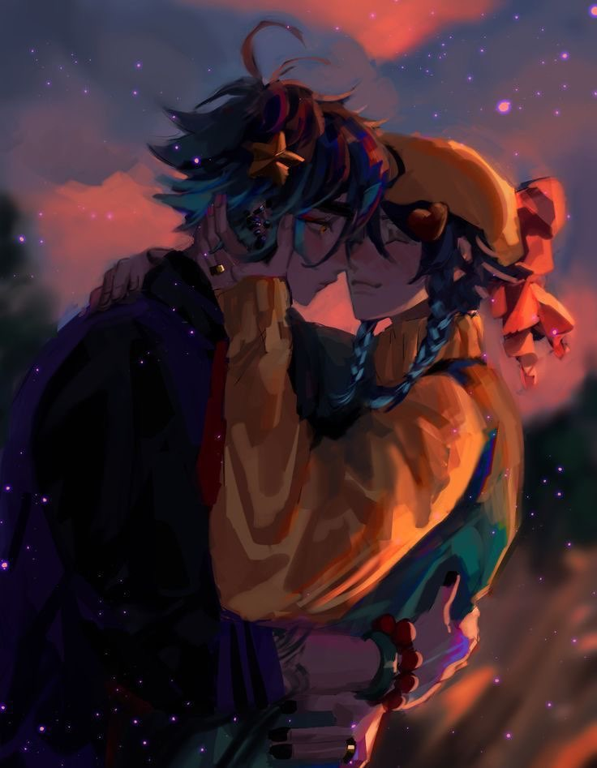

# Hello, I'm Emre ✨

  

## 👨‍💻 About Me
I'm a 20-year-old Computer Science student 🎓, deeply in love with the poetry of mathematics 📐 and the art of artificial intelligence 🤖. I believe in understanding the core 🧠 of AI and building it from scratch.

## 🌱 What I'm Learning
Currently, I'm immersing myself in:
- C++ for crafting efficient and elegant code 📝
- AI algorithms that mimic the complexity and beauty of the mind 🧩
- Mathematical concepts that are the universe's poetry 🔮

## 🎨 Projects & Interests
- Working on [Project Name] that explores [Project Description] 🛠️
- Engaging in mathematical research that unravels new patterns in nature 🌼
- Creating software that bridges the gap between technology and daily life 💡

## 📚 Currently Reading
- "Title of a book related to AI or Math"

## 🎵 Personal Notes
- In my downtime, I find joy in [Your Hobbies] 🎷
- Cherishing moments with my amazing girlfriend, Galina 💖

## 💌 Let's Connect
- Email: [your.email@example.com](mailto:your.email@example.com)
- LinkedIn: [Your LinkedIn](Your LinkedIn URL)

Feel free to reach out for a friendly chat or potential collaborations! 🌟

